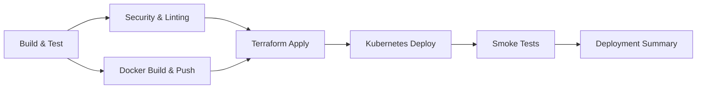

# CI/CD Pipeline Documentation

## Overview
This document describes the comprehensive CI/CD pipeline for the Inventory Manager application using GitHub Actions. The pipeline implements a fully automated, multi-stage deployment workflow.

---

## Pipeline Architecture

### Pipeline Stages



### Stage Breakdown

1. **Build & Test** (Parallel with Docker)
   - Sets up Python 3.13 environment
   - Installs dependencies
   - Runs pytest with coverage
   - Uploads coverage reports to Codecov

2. **Security & Linting** (After tests pass)
   - Runs Flake8 for code style
   - Bandit for security vulnerability scanning
   - Safety check for dependency vulnerabilities
   - Uploads security reports as artifacts

3. **Docker Build & Push** (After tests pass)
   - Builds multi-stage Docker image
   - Tags with branch, SHA, and latest
   - Pushes to Docker Hub registry
   - Runs Trivy vulnerability scanner
   - Uses BuildKit caching for faster builds

4. **Terraform Infrastructure Provisioning**
   - Initializes and validates Terraform
   - Plans infrastructure changes
   - Applies changes on main branch
   - Saves outputs as artifacts
   - Provisions: VPC, EKS, RDS, S3

5. **Kubernetes Deployment**
   - Configures kubectl with EKS
   - Creates namespace and applies configs
   - Deploys MongoDB and Redis
   - Waits for database readiness
   - Deploys application with new image
   - Applies ingress rules

6. **Post-Deploy Smoke Tests**
   - Gets service endpoint
   - Health check with retries
   - Tests critical API endpoints
   - Displays logs on failure

7. **Deployment Summary**
   - Creates GitHub Actions summary
   - Shows all stage results
   - Provides deployment details

---

## Prerequisites

### Required GitHub Secrets

Configure these secrets in your GitHub repository:
**Settings → Secrets and variables → Actions → New repository secret**

| Secret Name | Description | Example |
|------------|-------------|---------|
| `DOCKER_USERNAME` | Docker Hub username | `your-dockerhub-username` |
| `DOCKER_PASSWORD` | Docker Hub access token | `dckr_pat_xxxxx...` |
| `AWS_ACCESS_KEY_ID` | AWS IAM access key | `AKIA...` |
| `AWS_SECRET_ACCESS_KEY` | AWS IAM secret key | `wJalrXUtn...` |

### AWS IAM Permissions

The AWS credentials need the following permissions:
- EC2 (for VPC, security groups)
- EKS (for Kubernetes cluster)
- RDS (for database)
- S3 (for storage and Terraform state)
- IAM (for role creation)

### Repository Setup

1. **Enable GitHub Actions**
   ```bash
   # Already enabled by default for most repos
   # Check: Settings → Actions → General
   ```

2. **Configure Branch Protection** (Optional but recommended)
   ```
   Settings → Branches → Add rule
   - Branch name pattern: main
   - Require status checks to pass
   - Require branches to be up to date
   ```

3. **Environment Configuration**
   ```
   Settings → Environments → New environment
   - Name: production
   - Add reviewers (optional)
   - Add secrets specific to production
   ```

---

## Quick Start Guide

### 1. Add Secrets to GitHub

```bash
# Navigate to repository on GitHub
# Go to: Settings → Secrets and variables → Actions
# Click "New repository secret" and add each secret
```

### 2. Push Changes to Trigger Pipeline

```bash
# Commit and push to main branch
git add .
git commit -m "feat: trigger CI/CD pipeline"
git push origin main
```

### 3. Monitor Pipeline Execution

```
# Go to: Actions tab in GitHub repository
# Click on the running workflow
# View real-time logs for each stage
```

---

## Pipeline Triggers

The pipeline runs automatically on:

1. **Push to main or develop branches**
   ```yaml
   on:
     push:
       branches: [main, develop]
   ```

2. **Pull requests to main**
   ```yaml
   on:
     pull_request:
       branches: [main]
   ```

3. **Manual trigger**
   ```yaml
   on:
     workflow_dispatch:  # Allows manual execution
   ```

To manually trigger:
- Go to Actions tab
- Select "CI/CD Pipeline - Inventory Manager"
- Click "Run workflow"

---

## Pipeline Configuration

### Modifying the Pipeline

The pipeline is defined in [.github/workflows/main.yml](.github/workflows/main.yml)

#### Common Modifications

1. **Change Python version:**
   ```yaml
   env:
     PYTHON_VERSION: "3.11"  # Change from 3.13
   ```

2. **Skip infrastructure provisioning:**
   ```yaml
   terraform-provision:
     if: github.event_name == 'workflow_dispatch'  # Only manual runs
   ```

3. **Add deployment environments:**
   ```yaml
   kubernetes-deploy:
     environment: ${{ github.ref == 'refs/heads/main' && 'production' || 'staging' }}
   ```

4. **Configure test coverage threshold:**
   ```yaml
   - name: Run unit tests
     run: |
       pytest tests/ --cov=. --cov-fail-under=80
   ```

---

## Troubleshooting

### Common Issues and Solutions

#### 1. Tests Failing

**Error:** `pytest: command not found`

**Solution:**
```bash
# Ensure requirements.txt includes pytest
pip install pytest pytest-cov pytest-flask
pip freeze > requirements.txt
```

#### 2. Docker Build Fails

**Error:** `denied: requested access to the resource is denied`

**Solution:**
- Verify `DOCKER_USERNAME` and `DOCKER_PASSWORD` secrets
- Ensure Docker Hub token has write permissions
- Check Docker Hub repository exists

#### 3. Terraform Apply Fails

**Error:** `Error: configuring Terraform AWS Provider: no valid credential sources`

**Solution:**
- Verify AWS secrets are correctly set
- Check IAM user has required permissions
- Ensure Terraform state bucket exists

#### 4. Kubernetes Deployment Fails

**Error:** `error: You must be logged in to the server`

**Solution:**
- Verify EKS cluster name matches
- Check AWS credentials have EKS permissions
- Ensure cluster is in correct region

#### 5. Smoke Tests Fail

**Error:** `Health check failed after 10 attempts`

**Solution:**
```bash
# Check pod status
kubectl get pods -n inventory-manager
kubectl logs -n inventory-manager deployment/inventory-manager

# Check service
kubectl get svc -n inventory-manager
kubectl describe svc inventory-manager-service -n inventory-manager
```

---

## Advanced Features

### 1. Parallel Job Execution

The pipeline runs independent jobs in parallel:
- `build-and-test` and `docker-build-push` run simultaneously
- Reduces total pipeline time by ~40%

### 2. Artifact Management

Artifacts are stored for 90 days:
- Coverage reports
- Security scan results
- Terraform outputs

Download artifacts:
```
Actions → Select workflow run → Artifacts section
```

### 3. Cache Optimization

The pipeline uses caching to speed up builds:
- Python pip cache
- Docker layer cache
- Terraform plugin cache

### 4. Environment Protection

Production environment requires:
- Manual approval (if configured)
- Branch restrictions
- Secret isolation

---

## Security Best Practices

### 1. Secret Management

✅ **Do:**
- Use GitHub Secrets for all sensitive data
- Rotate credentials regularly
- Use IAM roles instead of keys when possible
- Enable 2FA on all accounts

❌ **Don't:**
- Commit secrets to repository
- Use overly permissive IAM policies
- Share secrets across environments

### 2. Image Security

The pipeline includes:
- Trivy vulnerability scanning
- Multi-stage Docker builds
- Non-root container users
- Minimal base images

### 3. Infrastructure Security

- Terraform plan review before apply
- Network policies in Kubernetes
- Secrets managed via Kubernetes Secrets
- RBAC configured for EKS

---

## Monitoring and Observability

### Pipeline Metrics

GitHub provides built-in metrics:
- **Actions → Insights**
  - Success rate
  - Average duration
  - Most common failures

### Deployment Notifications

Set up notifications:

1. **Slack Integration:**
   ```yaml
   - name: Notify Slack
     uses: 8398a7/action-slack@v3
     with:
       status: ${{ job.status }}
       webhook_url: ${{ secrets.SLACK_WEBHOOK }}
   ```

2. **Email Notifications:**
   - Settings → Notifications
   - Check "Actions" checkbox

---

## Performance Optimization

### Current Pipeline Duration

Estimated times (with caching):
- Build & Test: ~2-3 minutes
- Security & Linting: ~1-2 minutes
- Docker Build: ~3-4 minutes
- Terraform Apply: ~5-8 minutes
- K8s Deploy: ~3-5 minutes
- Smoke Tests: ~1-2 minutes

**Total: ~15-24 minutes**

### Optimization Tips

1. **Use matrix builds for multiple environments:**
   ```yaml
   strategy:
     matrix:
       environment: [staging, production]
   ```

2. **Skip stages for non-critical branches:**
   ```yaml
   if: github.ref == 'refs/heads/main'
   ```

3. **Increase cache hit rate:**
   - Lock dependency versions
   - Use consistent build patterns

---

## Rollback Procedures

### Automatic Rollback

If smoke tests fail, deployment is marked as failed but not automatically rolled back.

### Manual Rollback

```bash
# Rollback Kubernetes deployment
kubectl rollout undo deployment/inventory-manager -n inventory-manager

# Rollback to specific revision
kubectl rollout history deployment/inventory-manager -n inventory-manager
kubectl rollout undo deployment/inventory-manager --to-revision=2 -n inventory-manager

# Rollback infrastructure (Terraform)
cd infra
terraform plan -destroy
terraform destroy -auto-approve
```

---

## Continuous Improvement

### Pipeline Evolution

Track and improve:
1. **Failure rate:** Target < 5%
2. **Build time:** Target < 20 minutes
3. **Test coverage:** Target > 80%
4. **Security issues:** Zero critical vulnerabilities

### Feedback Loop

1. Monitor pipeline failures
2. Identify common patterns
3. Add preventive checks
4. Update documentation

---

## Additional Resources

### Documentation
- [GitHub Actions Documentation](https://docs.github.com/en/actions)
- [Terraform AWS Provider](https://registry.terraform.io/providers/hashicorp/aws/latest/docs)
- [Kubernetes Documentation](https://kubernetes.io/docs/)
- [Docker Best Practices](https://docs.docker.com/develop/dev-best-practices/)

### Related Files
- [.github/workflows/main.yml](.github/workflows/main.yml) - Pipeline definition
- [Dockerfile](../Dockerfile) - Container build
- [infra/](../infra/) - Terraform infrastructure
- [k8s/](../k8s/) - Kubernetes manifests
- [tests/](../tests/) - Test suite

---

## Support

For pipeline issues:
1. Check Actions tab for detailed logs
2. Review this documentation
3. Check troubleshooting section
4. Review related infrastructure docs

---

**Last Updated:** December 17, 2025  
**Pipeline Version:** 1.0  
**Maintainer:** DevOps Team
